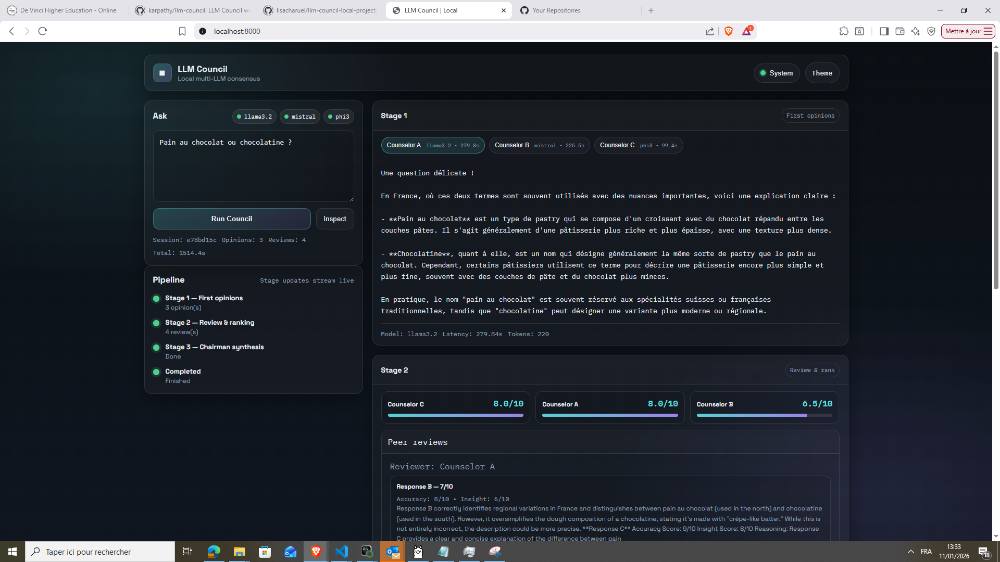
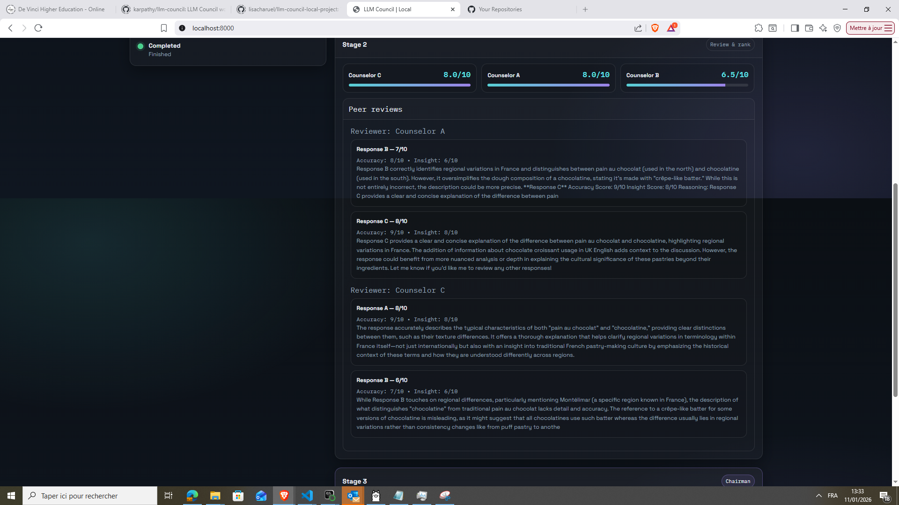

# LLM-Council-Processing_GenAI_Project

Projet de **LLM Council local** inspiré du concept d'Andrej Karpathy : plusieurs modèles de langage qui tournent en local vont collaborer pour répondre à une questiion en 3 étapes.

## Installation 
> [!WARNING]
> Necessite d'avoir Python 3.10-3.12 pour éviter les problèmes de compatibilité.
> Necessite d'avoir ollama avec 3 modèles aux choix (par défaut : llama 3.2 mistal phi3).

```bash
ollama list
git clone https://github.com/lisacharuel/llm-council-local-project.git
cd llm-council-local-project
conda create -n genai-project python==3.11 <- environnement
conda activate genai-project
pip install -r requirements.txt
```

## Configuration
Définir le mode utilisé pour le projet dans le `config.yaml` entre remote ou local (pour le chairman):
```bash
chairman:
  mode: local # local | remote
```

## Arborescence
```bash
C:.
│   .gitignore
│   config.yaml
│   README.md
│   requirements.txt
│   run.py
│
├───backend
│   │   config.py
│   │   council.py
│   │   llm_service.py
│   │   main.py
│   │   models.py
│   │   __init__.py
│   │
│   └───__pycache__
│           config.cpython-311.pyc
│           council.cpython-311.pyc
│           llm_service.cpython-311.pyc
│           main.cpython-311.pyc
│           models.cpython-311.pyc
│           __init__.cpython-311.pyc
│
├───frontend
│       app.js
│       index.html
│       package-lock.json
│       styles.css
│
└───scripts
        setup_ollama.sh
        test_api.py
```

## Utilisation
Ouvrir une invite de commande (cmd)
```bash
python run.py
```
Ouvrir le navigateur sur ce port : http://localhost:8000


## Fonctionnement
Le système exécute une pipeline complète :
1. **First Opinions** : plusieurs LLM génèrent des réponses indépendantes à la même question.
2. **Review & Ranking** : les modèles s'évaluent mutuellement de façon anonyme sur l'accuracy et l'insight de leurs réponses.
3. **Chairman Synthsis** : un modèle Chairman compile les réponses et les évaluations pour produire une synthèse finale.

L’inférence est réalisée 100% en local via Ollama, avec une architecture prévue pour être multi machines (council et chairman sur des PCs différents) tout ça grâcee à une API REST, et une interface web permettant d’inspecter les sorties des modèles et de suivre l’exécution en live.


## Rendu





## Auteur
**Marwan bns**